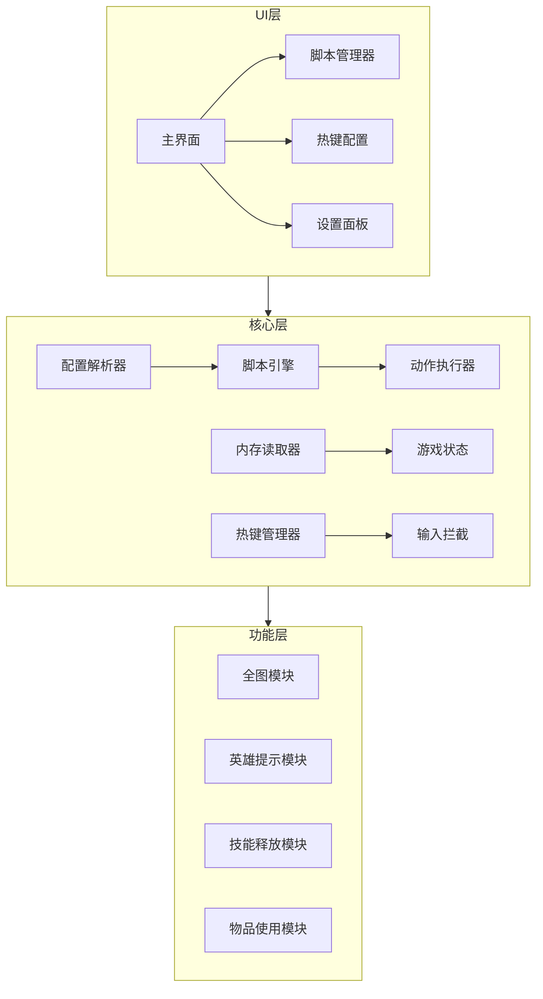
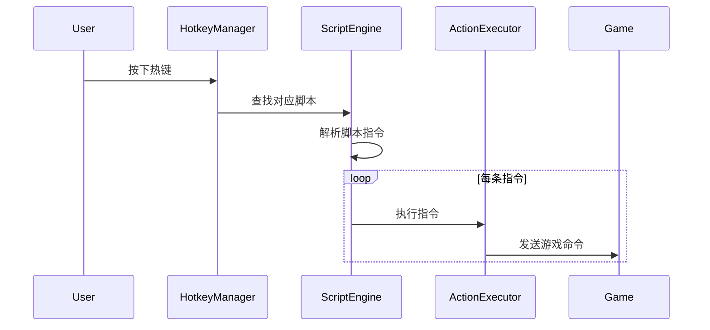

# 澄海3C游戏辅助软件设计文档

## 1. 项目概述

### 1.1 项目名称
澄海3C助手 (CH3C Assistant)

### 1.2 项目目标
开发一款针对魔兽争霸III澄海3C地图的游戏辅助软件，实现全图、敌人英雄提示等功能，并能加载和运行自定义脚本。

### 1.3 目标版本
支持澄海3C 5.45~6.87 全系列版本

---

## 2. 3C.txt配置文件分析

### 2.1 文件结构

配置文件 `3C.txt` 采用INI格式，包含以下主要部分：

| 区段 | 说明 |
|------|------|
| `[normal]` | 基本信息配置（版本、描述、作者） |
| `[hotkey.屏蔽]` | 需要屏蔽的按键列表 |
| `[hotkey.replace]` | 按键映射配置 |
| `[superFunc]` | 超级功能配置 |
| `[orderdefine]` | 技能指令定义（技能名=指令码） |
| `[action]` | 动作脚本定义 |
| `[hotkey.All]` | 全局热键绑定 |
| `[hotkey.英雄名]` | 各英雄专属热键绑定 |
| `[大招定义]` | 大招技能标识 |
| `[物品]` | 物品代码映射 |
| `[AbilityDefine]` | 状态/Buff定义 |
| `[技能]` | 技能代码映射 |
| `[商店.商店名]` | 商店物品配置 |

### 2.2 核心功能类型

从配置文件分析，主要功能包括：

1. **技能释放** - 自动释放技能、连招
2. **物品使用** - 自动使用物品（飓风、沉默、传送等）
3. **目标选择** - 自动选择敌人/盟友目标
4. **状态检测** - 检测单位状态（沉默、眩晕、变羊等）
5. **自动操作** - 自动打钱、自动加血、自动逃跑
6. **热键改键** - 小键盘按键映射
7. **提示功能** - 敌人位置提示、状态提示

---

## 3. 软件架构设计

### 3.1 整体架构图



### 3.2 模块详细设计

#### 3.2.1 配置解析模块 (ConfigParser)

**职责**: 解析3C.txt配置文件，提供配置数据访问接口

**主要类**:
```
ConfigParser
├── parseFile(path: string): Config
├── getSection(name: string): Section
├── getValue(section: string, key: string): string
└── getAction(name: string): Action
```

**数据结构**:
```
Config
├── version: string
├── description: string
├── author: string
├── orderDefines: Map<string, number>  // 技能指令码
├── actions: Map<string, Action>       // 动作脚本
├── hotkeys: Map<string, HotkeyConfig> // 热键配置
├── items: Map<string, string>         // 物品代码
└── abilities: Map<string, string>     // 技能代码
```

#### 3.2.2 内存读取模块 (MemoryReader)

**职责**: 读取游戏内存，获取游戏状态信息

**主要功能**:
- 查找游戏窗口和进程
- 读取单位信息（位置、血量、魔法、状态）
- 读取玩家信息（金币、木材、英雄列表）
- 读取地图信息（战争迷雾、可见区域）

**关键数据**:
```
GameState
├── isRunning: boolean
├── mapWidth: number
├── mapHeight: number
├── units: Unit[]
├── players: Player[]
└── localPlayer: Player

Unit
├── id: number
├── type: UnitType        // 英雄/小兵/建筑
├── name: string
├── position: Point
├── health: number
├── maxHealth: number
├── mana: number
├── maxMana: number
├── owner: Player
├── isEnemy: boolean
├── isVisible: boolean
├── buffs: Buff[]
└── items: Item[]
```

#### 3.2.3 全图模块 (MapHack)

**职责**: 实现全图功能，去除战争迷雾

**实现方式**:
1. 修改游戏内存中的迷雾相关数据
2. 或Hook DirectX渲染函数

**功能点**:
- 显示所有单位位置
- 显示敌方建筑
- 显示敌方英雄移动轨迹
- 可配置显示范围和类型

#### 3.2.4 敌人英雄提示模块 (HeroAlert)

**职责**: 检测并提示敌人英雄信息

**功能点**:
- 敌人英雄进入视野时声音/视觉提示
- 显示敌人英雄血量、魔法、状态
- 显示敌人英雄技能冷却
- 敌人英雄位置追踪

**提示方式**:
- 屏幕Overlay显示
- 声音警告
- 小地图标记

#### 3.2.5 脚本引擎模块 (ScriptEngine)

**职责**: 解析和执行动作脚本

**脚本语法解析**:
```
动作脚本格式:
动作名=指令1;指令2;指令3;...

指令类型:
- 动作=技能名,目标=目标类型,范围=数值
- 高级动作=等待出现,目标=目标类型,条件=条件列表
- 按键=键名
- 等待=时间
- 转第N步
- 提示=消息
```

**执行流程**:


#### 3.2.6 热键管理模块 (HotkeyManager)

**职责**: 管理全局热键注册和响应

**功能点**:
- 注册全局热键
- 拦截特定按键
- 按键映射/改键
- 热键冲突检测

**配置示例**:
```
[hotkey.All]
一键回家=SPACE
一键吹传=侧键
一键沉净牛=上滚
自动反补=K

[hotkey.黑暗游侠]
一键吸魔=W
一键符咒=F
```

#### 3.2.7 动作执行模块 (ActionExecutor)

**职责**: 执行具体的游戏动作

**支持的动作类型**:

| 动作类型 | 说明 | 示例 |
|----------|------|------|
| 技能释放 | 释放指定技能 | 动作=牛头人酋长战争践踏 |
| 物品使用 | 使用物品栏物品 | 动作=使用物品飓 |
| 移动 | 移动到指定位置 | 动作=move,目标=位置 |
| 攻击 | 攻击目标 | 动作=attack,目标=敌人英雄 |
| 选择 | 选择单位 | 高级动作=选择物体 |
| 购买 | 购买物品 | 高级动作=购买物品沉 |
| 学习 | 学习技能 | 高级动作=学习技能 |
| 等待 | 延时执行 | 等待1秒 |
| 按键 | 模拟按键 | 按键num_7 |

---

## 4. 技术选型

### 4.1 开发语言
- **C++** - 核心功能（内存读取、DLL注入）
- **C#** - 用户界面、脚本引擎

### 4.2 技术框架
- **Windows API** - 窗口管理、进程操作
- **DirectX SDK** - 图形Hook
- **EasyHook** - DLL注入
- **WPF/WinForms** - 用户界面

### 4.3 关键技术点

#### 4.3.1 游戏内存读取
```cpp
// 查找游戏窗口
HWND hWnd = FindWindow(L"Warcraft III", NULL);
// 获取进程ID
DWORD processId;
GetWindowThreadProcessId(hWnd, &processId);
// 打开进程
HANDLE hProcess = OpenProcess(PROCESS_VM_READ, FALSE, processId);
// 读取内存
ReadProcessMemory(hProcess, (LPCVOID)address, &value, sizeof(value), NULL);
```

#### 4.3.2 全图实现
方案A: 修改迷雾内存
```
// 迷雾相关偏移地址需要通过逆向分析获取
DWORD fogAddress = baseAddress + FOG_OFFSET;
WriteProcessMemory(hProcess, (LPVOID)fogAddress, &enableValue, sizeof(enableValue), NULL);
```

方案B: DirectX Hook
```
// Hook EndScene或Present函数
// 在渲染时绘制额外信息
```

---

## 5. 功能实现计划

### 5.1 第一阶段：基础框架
- [ ] 项目结构搭建
- [ ] 配置文件解析器
- [ ] 基本UI框架
- [ ] 热键管理基础

### 5.2 第二阶段：核心功能
- [ ] 游戏进程检测
- [ ] 内存读取模块
- [ ] 全图功能实现
- [ ] 敌人英雄提示

### 5.3 第三阶段：脚本系统
- [ ] 脚本解析引擎
- [ ] 动作执行器
- [ ] 条件判断系统
- [ ] 循环和跳转

### 5.4 第四阶段：完善优化
- [ ] 多版本支持
- [ ] 性能优化
- [ ] 错误处理
- [ ] 用户文档

---

## 6. 目录结构

```
CH3C/kilo/
├── src/
│   ├── core/                 # 核心模块
│   │   ├── ConfigParser.cpp  # 配置解析
│   │   ├── MemoryReader.cpp  # 内存读取
│   │   ├── ScriptEngine.cpp  # 脚本引擎
│   │   └── ActionExecutor.cpp# 动作执行
│   ├── features/             # 功能模块
│   │   ├── MapHack.cpp       # 全图功能
│   │   ├── HeroAlert.cpp     # 英雄提示
│   │   └── HotkeyManager.cpp # 热键管理
│   ├── ui/                   # 用户界面
│   │   ├── MainWindow.xaml   # 主窗口
│   │   ├── ScriptManager.xaml# 脚本管理
│   │   └── Settings.xaml     # 设置面板
│   └── utils/                # 工具类
│       ├── Logger.cpp        # 日志
│       └── Utils.cpp         # 通用工具
├── scripts/                  # 脚本文件
│   └── 3C.txt               # 配置脚本
├── docs/                     # 文档
│   ├── DESIGN.md            # 设计文档
│   └── USER_GUIDE.md        # 用户指南
├── build/                    # 编译输出
├── CMakeLists.txt           # 构建配置
└── README.md                # 项目说明
```

---

## 7. 安全与合规说明

### 7.1 免责声明
本软件仅供学习和研究目的，使用本软件可能违反游戏服务条款，请用户自行承担风险。

### 7.2 安全措施
- 不修改游戏核心文件
- 不发送网络数据包
- 仅读取必要内存

---

## 8. 参考资料

- 魔兽争霸III内存结构分析
- DirectX Hook技术
- Windows进程内存操作API
- INI文件格式规范
