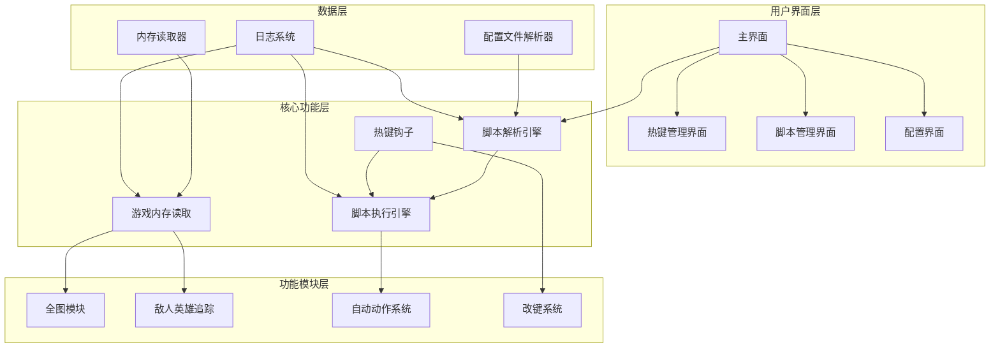
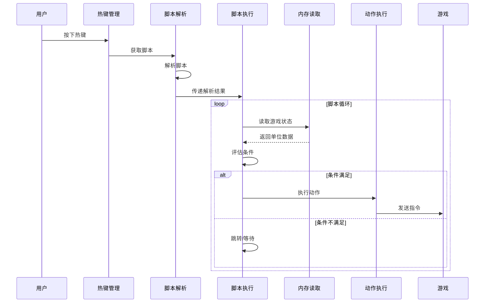

# 澄海3C游戏辅助软件设计方案

## 1. 项目概述

### 1.1 项目名称
澄海3C游戏辅助工具 (CH3C Assistant)

### 1.2 项目目标
设计并实现一款针对魔兽争霸III澄海3C地图的游戏辅助软件，支持：
- 全图功能（去除战争迷雾）
- 敌人英雄提示与追踪
- 脚本加载与执行系统
- 热键管理与改键功能

### 1.3 目标游戏版本
- 魔兽争霸III: 澄海3C地图 5.45~6.87 全系列

### 1.4 开发与运行环境

#### 开发环境
- **操作系统**: WSL (Windows Subsystem for Linux)
- **开发工具**: VSCode / PyCharm
- **Python版本**: Python 3.10+

#### 运行环境
- **操作系统**: Windows 10/11
- **目标进程**: Warcraft III.exe

#### 跨平台开发策略
由于开发环境(WSL)与运行环境(Windows)不同，需要采用以下策略：

1. **代码兼容性设计**
   - 核心业务逻辑使用纯Python，避免Linux特有API
   - Windows特有功能（内存读取、DLL注入）通过条件导入隔离
   - 使用 `sys.platform` 或 `platform.system()` 进行平台检测

2. **依赖管理**
   - Windows特有依赖标记为可选安装
   - 使用 `requirements-windows.txt` 单独管理Windows依赖
   - 提供 `pip install -e .` 开发模式安装

3. **测试策略**
   - 单元测试在WSL环境运行（mock Windows API）
   - 集成测试需要在Windows环境运行
   - 提供自动化测试脚本

4. **构建与发布**
   - 使用GitHub Actions进行CI/CD
   - 在Windows runner上执行最终构建
   - 生成Windows可执行文件(.exe)

---

## 2. 配置文件分析

### 2.1 3C.txt 文件结构分析

配置文件采用INI格式，包含以下主要部分：

#### 2.1.1 基本信息区段 `[normal]`
```
ver=6.87
desc=倚天至尊2025版 for 澄海5.45~6.87 全系列豪华套装
author=倚天 http://www.yitian.xyz
```

#### 2.1.2 热键屏蔽区段 `[hotkey.屏蔽]`
定义需要屏蔽的默认按键，如 `space`, `~`, `ESC`

#### 2.1.3 热键替换区段 `[hotkey.replace]`
定义小键盘按键映射：
- `num_7`, `num_8`, `num_4`, `num_5`, `num_1`, `num_2`

#### 2.1.4 超级功能区段 `[superFunc]`
- `ctrl_click转右键_shift_h`
- `ctrl_right_click转A_点击`
- `right_click转m_shift_h`

#### 2.1.5 技能指令定义区段 `[orderdefine]`
定义各英雄技能的游戏内部指令ID，格式：
```
牛头人酋长战争践踏=0x0d009f
恐惧魔王混乱之雨=0x000D010D
血魔法师烈焰风暴=0x000D0208
...
```

#### 2.1.6 动作脚本区段 `[action]`
核心脚本定义，包含：
- **基础动作**: `动作=技能名,目标=xxx,范围=xxx`
- **高级动作**: `高级动作=等待出现/如果出现,目标=xxx,条件=xxx`
- **全局脚本**: 标记为 `全局脚本` 的动作会持续运行

**脚本语法元素**:
| 元素 | 说明 | 示例 |
|------|------|------|
| `动作=` | 基础动作定义 | `动作=牛头人酋长战争践踏` |
| `高级动作=` | 带条件的动作 | `高级动作=等待出现,目标=敌人英雄,范围=800` |
| `目标=` | 目标类型 | `敌人英雄`, `自己英雄`, `盟友建筑`, `敌人非建筑` |
| `范围=` | 搜索范围 | `800`, `1000`, `100000` |
| `状态=` | 单位状态检测 | `被沉默的`, `被击晕的`, `被变羊的` |
| `条件=` | 附加条件 | `血少于30%`, `拥有物品传` |
| `技能状态=` | 技能状态检测 | `大招`, `使用物品传`, `全部技能` |
| `转第N步` | 流程跳转 | `转第1步`, `转$a` |
| `等待X秒` | 延时执行 | `等待0.5秒`, `等待1秒` |
| `提示=` | 屏幕提示 | `提示=天下第一沉` |
| `屏蔽默认键` | 阻止原按键 | 放在脚本开头 |

#### 2.1.7 热键绑定区段 `[hotkey.All]`, `[hotkey.英雄名]`
定义各脚本的热键绑定：
```
自动净全局=CTRL+NUM_9
虐牛沉吹断踩全局=NUM_9
一键回家=SPACE
```

#### 2.1.8 大招定义区段 `[大招定义]`
标记哪些技能属于大招：
```
炼金术士沉沦之渊=1
深渊魔王火焰雨=1
光明游侠穿梭冰箭=1
```

#### 2.1.9 物品定义区段 `[物品]`
物品内部ID映射：
```
重生十字章=ankh
匕首=desc
传=stel
飓=wcyc
沉=ssil
```

#### 2.1.10 技能定义区段 `[技能]`, `[技能.英雄名]`
技能内部ID映射：
```
诱捕风暴=A00W
战争践踏=AOws
震荡波=AOsh
```

#### 2.1.11 状态定义区段 `[AbilityDefine]`
状态效果内部ID：
```
被纠缠根须的=BEer
嗜血=Bblo
被净化的=Bprg
```

---

## 3. 软件架构设计

### 3.1 整体架构图



### 3.2 模块详细设计

#### 3.2.1 配置文件解析器 (ConfigParser)

**职责**: 解析3C.txt格式的配置文件

**类设计**:
```python
class ConfigParser:
    def __init__(self, config_path: str)
    def parse(self) -> dict
    def get_section(self, section_name: str) -> dict
    def get_action(self, action_name: str) -> str
    def get_hotkey(self, script_name: str) -> str
    def get_order_id(self, skill_name: str) -> int
    def get_item_id(self, item_name: str) -> str
    def get_ability_id(self, ability_name: str) -> str
```

**数据结构**:
```python
config_data = {
    'normal': {'ver': '6.87', 'desc': '...', 'author': '...'},
    'hotkey.屏蔽': {'列表': 'space,~,ESC'},
    'hotkey.replace': {'num_7': '', 'num_8': '', ...},
    'superFunc': {'ctrl_click转右键_shift_h': '0', ...},
    'orderdefine': {'牛头人酋长战争践踏': 0x0d009f, ...},
    'action': {'沉吹匕首牛': '等牛;沉牛;等待1秒;吹牛;转第1步', ...},
    'hotkey.All': {'天下第一沉+飓藐视': '', '自动断传': '', ...},
    'hotkey.黑暗游侠': {'黑箭大招': '', 'C兵': '', ...},
    '大招定义': {'炼金术士沉沦之渊': 1, ...},
    '物品': {'重生十字章': 'ankh', ...},
    '技能': {'诱捕风暴': 'A00W', ...},
    'AbilityDefine': {'被纠缠根须的': 'BEer', ...}
}
```

#### 3.2.2 脚本解析引擎 (ScriptParser)

**职责**: 将脚本文本解析为可执行的指令序列

**脚本语法解析**:

```python
class ScriptToken:
    type: str  # ACTION, CONDITION, TARGET, PARAM, FLOW_CONTROL
    value: str
    params: dict

class ParsedScript:
    name: str
    is_global: bool
    priority: str  # '高', '普通'
    blocks: List[ScriptBlock]
    labels: Dict[str, int]  # 标签位置映射

class ScriptBlock:
    block_type: str  # 'action', 'advanced_action', 'wait', 'goto', 'label'
    content: str
    conditions: List[Condition]
    actions: List[Action]
```

**解析流程**:


**关键解析规则**:

| 脚本元素 | 解析规则 |
|---------|---------|
| `全局脚本` | 标记为全局运行脚本 |
| `屏蔽默认键` | 设置block_default_key=True |
| `优先级=高` | 设置priority='high' |
| `高级动作=xxx` | 解析为条件执行块 |
| `动作=xxx` | 解析为直接执行动作 |
| `等待X秒` | 解析为延时指令 |
| `转第N步` / `转$label` | 解析为跳转指令 |
| `提示=xxx` | 解析为UI提示动作 |

#### 3.2.3 游戏内存读取模块 (GameMemoryReader)

**职责**: 读取魔兽争霸III游戏内存数据

**关键数据结构**:
```python
class GameUnit:
    handle: int
    unit_id: int
    name: str
    x: float
    y: float
    z: float
    hp: int
    max_hp: int
    mp: int
    max_mp: int
    level: int
    owner: int  # 玩家ID
    team: int   # 阵营
    is_hero: bool
    is_alive: bool
    is_visible: bool
    is_illusion: bool
    abilities: List[Ability]
    items: List[Item]
    buffs: List[Buff]

class GameState:
    game_time: float
    map_width: int
    map_height: int
    my_player_id: int
    my_team: int
    units: Dict[int, GameUnit]  # handle -> Unit
    heroes: List[GameUnit]
    enemy_heroes: List[GameUnit]
    ally_heroes: List[GameUnit]
    buildings: List[GameUnit]
```

**内存偏移量** (需要根据游戏版本动态获取):
```python
class MemoryOffsets:
    GAME_BASE = 0x6F000000  # 游戏基址
    PLAYER_ARRAY = 0x...     # 玩家数组
    UNIT_ARRAY = 0x...       # 单位数组
    UNIT_HP_OFFSET = 0x...   # 血量偏移
    UNIT_MP_OFFSET = 0x...   # 魔量偏移
    UNIT_X_OFFSET = 0x...    # X坐标偏移
    UNIT_Y_OFFSET = 0x...    # Y坐标偏移
    FOG_OF_WAR = 0x...       # 战争迷雾地址
```

#### 3.2.4 全图功能模块 (MapHack)

**职责**: 去除战争迷雾，显示全地图单位

**实现方式**:
1. **内存修改法**: 直接修改游戏内存中的迷雾数据
2. **DLL注入法**: 注入DLL到游戏进程，Hook相关函数

```python
class MapHack:
    def __init__(self, memory_reader: GameMemoryReader)
    
    def enable_full_map(self):
        """开启全图"""
        # 方法1: 修改迷雾内存
        self.memory_reader.write_bytes(
            self.fog_of_war_addr, 
            b'\x00' * 4
        )
        
    def disable_full_map(self):
        """关闭全图"""
        self.restore_fog()
        
    def reveal_area(self, x: float, y: float, radius: float):
        """显示指定区域"""
        
    def hide_area(self, x: float, y: float, radius: float):
        """隐藏指定区域"""
```

#### 3.2.5 敌人英雄追踪模块 (EnemyHeroTracker)

**职责**: 实时追踪敌人英雄位置和状态

```python
class EnemyHeroTracker:
    def __init__(self, memory_reader: GameMemoryReader)
    
    def get_enemy_heroes(self) -> List[GameUnit]:
        """获取所有敌人英雄"""
        
    def get_hero_position(self, hero_name: str) -> Tuple[float, float]:
        """获取指定英雄位置"""
        
    def get_hero_status(self, hero_name: str) -> HeroStatus:
        """获取英雄状态"""
        
    def is_hero_casting_ultimate(self, hero: GameUnit) -> bool:
        """检测英雄是否正在释放大招"""
        
    def get_hero_items(self, hero: GameUnit) -> List[Item]:
        """获取英雄物品栏"""
        
    def track_hero(self, hero_name: str, callback: Callable):
        """追踪指定英雄，状态变化时回调"""
```

**状态检测**:
```python
class HeroStatus:
    is_silenced: bool      # 被沉默
    is_stunned: bool       # 被击晕
    is_sheeped: bool       # 被变羊
    is_sleeping: bool      # 被睡眠
    is_rooted: bool        # 被纠缠根须
    is_cycloned: bool      # 被飓风吹起
    is_magic_immune: bool  # 魔免状态
    is_invulnerable: bool  # 无敌状态
    hp_percent: float      # 血量百分比
    mp_percent: float      # 魔量百分比
    is_visible: bool       # 是否可见
    distance_to_me: float  # 与自己距离
```

#### 3.2.6 脚本执行引擎 (ScriptExecutor)

**职责**: 执行解析后的脚本

```python
class ScriptExecutor:
    def __init__(self, memory_reader, hero_tracker, action_executor)
    
    def execute_script(self, script: ParsedScript):
        """执行脚本"""
        
    def execute_block(self, block: ScriptBlock, context: ExecutionContext):
        """执行单个代码块"""
        
    def evaluate_condition(self, condition: Condition, context: ExecutionContext) -> bool:
        """评估条件"""
        
    def execute_action(self, action: Action, context: ExecutionContext):
        """执行动作"""

class ExecutionContext:
    current_unit: GameUnit      # 当前选中单位
    target_unit: GameUnit       # 目标单位
    appeared_units: List[GameUnit]  # 出现的单位
    variables: Dict[str, any]   # 脚本变量
    script: ParsedScript        # 当前脚本
    current_step: int           # 当前步骤
```

**条件评估示例**:
```python
def evaluate_condition(condition: Condition, ctx: ExecutionContext) -> bool:
    # 目标类型检查
    if condition.target == '敌人英雄':
        units = ctx.enemy_heroes
    elif condition.target == '自己英雄':
        units = ctx.my_heroes
    # ... 其他目标类型
    
    # 范围检查
    if condition.range:
        units = [u for u in units if distance(ctx.current_unit, u) <= condition.range]
    
    # 状态检查
    for state in condition.states:
        if state == '被沉默的':
            units = [u for u in units if u.has_buff('silence')]
        # ... 其他状态
    
    # 条件检查
    if condition.hp_less_than:
        units = [u for u in units if u.hp_percent < condition.hp_less_than]
    
    return len(units) > 0
```

#### 3.2.7 动作执行器 (ActionExecutor)

**职责**: 执行游戏内动作

```python
class ActionExecutor:
    def __init__(self, game_interface: GameInterface)
    
    def use_skill(self, skill_name: str, target, target_type: str):
        """使用技能"""
        order_id = self.config.get_order_id(skill_name)
        self.game_interface.send_order(order_id, target)
        
    def use_item(self, item_name: str, target):
        """使用物品"""
        item_id = self.config.get_item_id(item_name)
        self.game_interface.use_item(item_id, target)
        
    def attack(self, target):
        """攻击目标"""
        self.game_interface.send_command('attack', target)
        
    def move(self, x: float, y: float):
        """移动到位置"""
        self.game_interface.send_command('move', (x, y))
        
    def select_unit(self, unit: GameUnit):
        """选择单位"""
        self.game_interface.select_unit(unit.handle)
        
    def press_key(self, key: str):
        """模拟按键"""
        self.game_interface.simulate_key(key)
        
    def left_click(self, x: float = None, y: float = None):
        """左键点击"""
        self.game_interface.simulate_mouse('left', x, y)
        
    def right_click(self, x: float = None, y: float = None):
        """右键点击"""
        self.game_interface.simulate_mouse('right', x, y)
```

#### 3.2.8 热键管理系统 (HotkeyManager)

**职责**: 管理全局热键和改键

```python
class HotkeyManager:
    def __init__(self):
        self.hotkeys: Dict[str, Callable] = {}
        self.key_remaps: Dict[str, str] = {}
        self.blocked_keys: Set[str] = set()
        
    def register_hotkey(self, key_combo: str, callback: Callable):
        """注册热键"""
        # 解析组合键: CTRL+NUM_9, SPACE, etc.
        keys = parse_key_combo(key_combo)
        self.hotkeys[key_combo] = callback
        
    def remap_key(self, source_key: str, target_key: str):
        """改键映射"""
        self.key_remaps[source_key] = target_key
        
    def block_key(self, key: str):
        """屏蔽按键"""
        self.blocked_keys.add(key)
        
    def on_key_event(self, key: str, is_down: bool) -> bool:
        """按键事件处理，返回是否拦截"""
        # 检查是否屏蔽
        if key in self.blocked_keys:
            return True  # 拦截
            
        # 检查改键
        if key in self.key_remaps:
            new_key = self.key_remaps[key]
            self.simulate_key(new_key)
            return True  # 拦截原按键
            
        # 检查热键
        if key in self.hotkeys and is_down:
            self.hotkeys[key]()
            return True
            
        return False  # 不拦截
```

---

## 4. 核心功能实现

### 4.1 全图功能实现

#### 4.1.1 实现原理
魔兽争霸III的战争迷雾由两部分组成：
1. **黑色迷雾**: 未探索区域
2. **战争迷雾**: 已探索但当前不可见区域

#### 4.1.2 实现方案

**方案A: 内存修改**
```python
def enable_maphack():
    # 1. 找到游戏进程
    process = find_process('Warcraft III.exe')
    
    # 2. 获取游戏基址
    base_addr = get_module_base(process, 'Game.dll')
    
    # 3. 计算迷雾地址
    fog_addr = base_addr + FOG_OFFSET
    
    # 4. 修改迷雾值
    write_memory(process, fog_addr, 0)
```

**方案B: DLL注入**
```cpp
// Maphack.cpp
DWORD WINAPI MaphackThread(LPVOID lpParam) {
    // Hook IsVisible函数
    DetourFunction((PBYTE)IsVisibleAddr, (PBYTE)IsVisibleHook);
    return 0;
}

BOOL __fastcall IsVisibleHook(DWORD* unit) {
    return TRUE;  // 始终返回可见
}
```

### 4.2 敌人英雄提示实现

#### 4.2.1 功能需求
- 实时显示敌人英雄位置
- 检测敌人英雄状态（血量、魔量、buff）
- 检测敌人英雄技能状态（是否在释放大招）
- 提示敌人英雄进入范围

#### 4.2.2 实现方案

```python
class HeroAlertSystem:
    def __init__(self, tracker: EnemyHeroTracker):
        self.tracker = tracker
        self.alert_rules: List[AlertRule] = []
        
    def add_alert_rule(self, rule: AlertRule):
        """添加提示规则"""
        self.alert_rules.append(rule)
        
    def update(self):
        """每帧更新"""
        for hero in self.tracker.get_enemy_heroes():
            for rule in self.alert_rules:
                if rule.matches(hero):
                    self.show_alert(rule, hero)
                    
    def show_alert(self, rule: AlertRule, hero: GameUnit):
        """显示提示"""
        # 屏幕提示
        if rule.show_screen_alert:
            self.draw_screen_text(
                f"{hero.name} {rule.message}",
                hero.screen_x, hero.screen_y,
                color=rule.color
            )
        # 声音提示
        if rule.play_sound:
            self.play_sound_file(rule.sound_file)
        # 小地图标记
        if rule.minimap_marker:
            self.draw_minimap_circle(hero.x, hero.y, rule.radius)

class AlertRule:
    hero_names: List[str]  # 监听的英雄名
    conditions: List[str]  # 触发条件: 血少于30%, 释放大招, 进入范围
    message: str           # 提示消息
    color: str             # 提示颜色
    show_screen_alert: bool
    play_sound: bool
    minimap_marker: bool
```

### 4.3 脚本执行流程



---

## 5. 用户界面设计

### 5.1 主界面布局

```
┌─────────────────────────────────────────────────────────────┐
│  澄海3C辅助工具 v1.0                              [_][□][×] │
├─────────────────────────────────────────────────────────────┤
│  ┌─────────┬─────────────────────────────────────────────┐  │
│  │ 功能    │                                           │  │
│  │ ├全图   │  ┌─────────────────────────────────────┐  │  │
│  │ ├英雄   │  │ 脚本列表                            │  │  │
│  │ ├脚本   │  │ ├[全局] 自动净全局      CTRL+NUM_9 │  │  │
│  │ └设置   │  │ ├[全局] 断传全局                  │  │  │
│  │         │  │ ├[全局] 低血自动回家全局          │  │  │
│  │         │  │ ├[一键] 一键回家          SPACE   │  │  │
│  │         │  │ ├[一键] 一键沉净牛        上滚    │  │  │
│  │         │  │ └...                                │  │  │
│  │         │  └─────────────────────────────────────┘  │  │
│  │         │                                           │  │
│  │         │  ┌─────────────────────────────────────┐  │  │
│  │         │  │ 脚本详情                            │  │  │
│  │         │  │ 名称: 自动净全局                    │  │  │
│  │         │  │ 类型: 全局脚本                      │  │  │
│  │         │  │ 热键: CTRL+NUM_9                    │  │  │
│  │         │  │ 状态: 运行中                        │  │  │
│  │         │  └─────────────────────────────────────┘  │  │
│  └─────────┴─────────────────────────────────────────────┘  │
├─────────────────────────────────────────────────────────────┤
│  状态: 已连接游戏 | 运行脚本: 3 | CPU: 2.5% | 内存: 45MB   │
└─────────────────────────────────────────────────────────────┘
```

### 5.2 全图功能界面

```
┌─────────────────────────────────────┐
│ 全图设置                            │
├─────────────────────────────────────┤
│ ☑ 启用全图                          │
│ ☑ 显示敌人英雄位置                  │
│ ☑ 显示敌人单位                      │
│ ☐ 显示隐身单位                      │
│ ☐ 显示敌方视野范围                  │
│                                     │
│ 提示设置:                           │
│ ☑ 敌人英雄进入范围提示              │
│ 提示范围: [800] 像素                │
│ ☑ 敌人释放大招提示                  │
│ ☑ 低血量敌人提示                    │
│ 血量阈值: [30]%                     │
│                                     │
│          [保存设置]  [取消]         │
└─────────────────────────────────────┘
```

---

## 6. 技术选型

### 6.1 开发语言
- **主程序**: Python 3.10+ (快速开发，丰富的库支持)
- **核心模块**: C++ (内存读取、DLL注入等高性能需求，可选)
- **UI框架**: PyQt6 / PySide6

### 6.2 依赖管理

#### 通用依赖 (requirements.txt)
```txt
# 核心依赖 - 跨平台
PyQt6>=6.5.0           # GUI框架
psutil>=5.9.0          # 进程管理
pyinstaller>=6.0.0     # 打包工具

# 配置解析
configparser           # INI配置解析 (标准库)

# 日志
colorlog>=6.7.0        # 彩色日志输出
```

#### Windows特有依赖 (requirements-windows.txt)
```txt
# Windows特有依赖 - 仅在Windows环境安装
pymem>=1.10.0          # 内存读取
pywin32>=305           # Windows API
keyboard>=0.13.5       # 键盘钩子
mouse>=0.7.1           # 鼠标钩子
```

#### 开发依赖 (requirements-dev.txt)
```txt
# 测试
pytest>=7.4.0
pytest-cov>=4.1.0
pytest-mock>=3.11.0

# 代码质量
black>=23.0.0
flake8>=6.1.0
mypy>=1.5.0

# 类型存根
types-psutil>=2.0.0
```

### 6.3 跨平台代码组织

#### 平台检测与条件导入
```python
# src/game/platform.py
import sys
import platform

IS_WINDOWS = sys.platform == 'win32' or platform.system() == 'Windows'
IS_LINUX = sys.platform.startswith('linux')
IS_WSL = IS_LINUX and 'microsoft' in platform.release().lower()

def get_platform():
    """获取当前平台类型"""
    if IS_WSL:
        return 'wsl'
    elif IS_WINDOWS:
        return 'windows'
    elif IS_LINUX:
        return 'linux'
    else:
        return 'unknown'

# 条件导入Windows特有模块
if IS_WINDOWS:
    try:
        import pymem
        import win32api
        import win32con
        import keyboard
        import mouse
        WINDOWS_MODULES_AVAILABLE = True
    except ImportError:
        WINDOWS_MODULES_AVAILABLE = False
else:
    WINDOWS_MODULES_AVAILABLE = False
```

#### 内存读取模块抽象
```python
# src/game/memory_reader_base.py
from abc import ABC, abstractmethod
from typing import Optional, List, Dict, Any

class MemoryReaderBase(ABC):
    """内存读取器基类 - 定义接口"""
    
    @abstractmethod
    def attach(self, process_name: str) -> bool:
        """附加到进程"""
        pass
    
    @abstractmethod
    def read_bytes(self, address: int, size: int) -> bytes:
        """读取内存字节"""
        pass
    
    @abstractmethod
    def read_int(self, address: int) -> int:
        """读取整数"""
        pass
    
    @abstractmethod
    def read_float(self, address: int) -> float:
        """读取浮点数"""
        pass
    
    @abstractmethod
    def write_bytes(self, address: int, data: bytes) -> bool:
        """写入内存字节"""
        pass

# src/game/memory_reader_factory.py
from .memory_reader_base import MemoryReaderBase
from .platform import IS_WINDOWS, WINDOWS_MODULES_AVAILABLE

def get_memory_reader() -> MemoryReaderBase:
    """获取适合当前平台的内存读取器"""
    if IS_WINDOWS and WINDOWS_MODULES_AVAILABLE:
        from .memory_reader_windows import WindowsMemoryReader
        return WindowsMemoryReader()
    else:
        from .memory_reader_mock import MockMemoryReader
        return MockMemoryReader()

# src/game/memory_reader_windows.py
class WindowsMemoryReader(MemoryReaderBase):
    """Windows平台内存读取器实现"""
    def __init__(self):
        self.process = None
        
    def attach(self, process_name: str) -> bool:
        import pymem
        self.process = pymem.Pymem(process_name)
        return True
    
    # ... 其他方法实现

# src/game/memory_reader_mock.py
class MockMemoryReader(MemoryReaderBase):
    """模拟内存读取器 - 用于WSL开发测试"""
    def __init__(self):
        self._mock_data = {}
        
    def attach(self, process_name: str) -> bool:
        return True  # 模拟成功
    
    def read_int(self, address: int) -> int:
        return self._mock_data.get(address, 0)
    
    def set_mock_data(self, address: int, value: Any):
        """设置模拟数据 - 用于测试"""
        self._mock_data[address] = value
```

### 6.4 项目结构
```
ch3c-assistant/
├── src/
│   ├── core/
│   │   ├── __init__.py
│   │   ├── config_parser.py      # 配置解析
│   │   ├── script_parser.py      # 脚本解析
│   │   ├── script_executor.py    # 脚本执行
│   │   ├── action_executor.py    # 动作执行
│   │   └── hotkey_manager.py     # 热键管理
│   ├── game/
│   │   ├── __init__.py
│   │   ├── platform.py           # 平台检测
│   │   ├── memory_reader_base.py # 内存读取器基类
│   │   ├── memory_reader_factory.py # 工厂方法
│   │   ├── memory_reader_windows.py # Windows实现
│   │   ├── memory_reader_mock.py    # Mock实现(WSL测试)
│   │   ├── game_interface.py     # 游戏接口
│   │   ├── maphack.py            # 全图功能
│   │   └── hero_tracker.py       # 英雄追踪
│   ├── ui/
│   │   ├── main_window.py        # 主窗口
│   │   ├── script_panel.py       # 脚本面板
│   │   ├── maphack_panel.py      # 全图面板
│   │   └── settings_dialog.py    # 设置对话框
│   └── utils/
│       ├── logger.py             # 日志
│       ├── process_utils.py      # 进程工具
│       └── key_utils.py          # 按键工具
├── scripts/
│   └── 3C.txt                    # 默认脚本配置
├── assets/
│   ├── icons/                    # 图标
│   └── sounds/                   # 提示音效
├── tests/
│   ├── test_config_parser.py
│   ├── test_script_parser.py
│   └── test_executor.py
├── docs/
│   ├── user_guide.md             # 用户手册
│   └── script_syntax.md          # 脚本语法说明
├── requirements.txt
├── setup.py
└── README.md
```

---

## 7. 安全与风险

### 7.1 使用风险
- 本软件属于游戏辅助工具，可能违反游戏服务条款
- 使用可能导致游戏账号被封禁
- 仅限学习研究使用，请勿用于商业用途

### 7.2 技术风险
- 内存读取可能被反作弊系统检测
- 需要管理员权限运行
- 不同游戏版本可能需要更新偏移量

### 7.3 安全措施
- 不修改游戏文件
- 仅读取必要内存数据
- 提供版本兼容性检测

---

## 8. 开发计划

### 8.1 阶段划分

| 阶段 | 内容 | 优先级 |
|------|------|--------|
| 第一阶段 | 配置解析器、脚本解析器 | 高 |
| 第二阶段 | 内存读取、游戏接口 | 高 |
| 第三阶段 | 全图功能、英雄追踪 | 高 |
| 第四阶段 | 脚本执行引擎 | 高 |
| 第五阶段 | 热键管理、改键系统 | 中 |
| 第六阶段 | 用户界面 | 中 |
| 第七阶段 | 测试与优化 | 中 |
| 第八阶段 | 打包发布 | 低 |

---

## 9. 附录

### 9.1 脚本语法完整参考

详见 [`script_syntax.md`](docs/script_syntax.md)

### 9.2 支持的英雄列表

根据配置文件，支持以下英雄：
- 牛头人酋长
- 恐惧魔王
- 血魔法师
- 修补匠
- 大魔法师
- 巫妖
- 守望者
- 炼金术士
- 深渊魔王
- 圣骑士
- 死亡骑士
- 暗影猎手
- 丛林守护者
- 月之女祭司
- 剑圣
- 恶魔猎手
- 娜迦女海巫
- 熊猫酒仙
- 山丘之王
- 先知
- 地穴领主
- 火焰巨魔
- 兽王领袖
- 大德鲁伊
- 黑暗游侠
- 光明游侠
- 女巫
- 黑暗骑士
- 合体熊猫

### 9.3 版本兼容性

| 游戏版本 | 状态 |
|---------|------|
| 澄海5.45 | 支持 |
| 澄海5.56 | 支持 |
| 澄海6.xx | 支持 |
| 澄海6.87 | 支持 |
